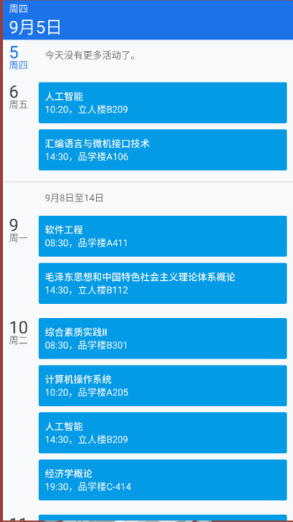
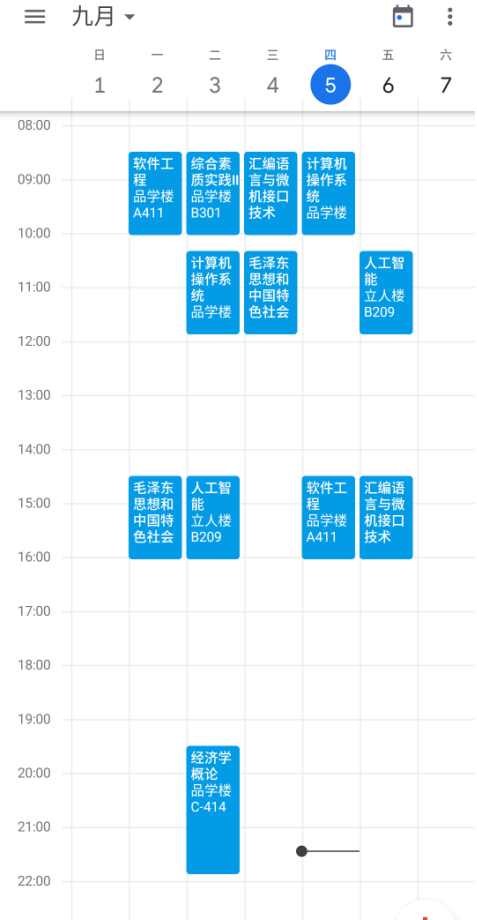

# usetc-course-table-to-ics
## 说明
根据[课表所在页面](http://eams.uestc.edu.cn/eams/courseTableForStd!courseTable.action)的html文件生成标准日历文件(.ics)，可导入到[google日历](https://calendar.google.com)，微软日历，等其他所有支持ics文件导入的日历中

## 使用
- 直接运行`main.py`即可，该文件目录应包含`courseTable.html`
- `courseTable.html`可在[课表所在页面](http://eams.uestc.edu.cn/eams/courseTableForStd!courseTable.action)通过`Ctrl+S`保存
- 暂不支通过信息门户的账号和密码爬取（以后有空加上）
## 目前已知支持ICS的日历
- 谷歌日历
- 微软日历
- oppo日历
- 华为日历
- 待补充
## 截图
桌面小部件：

谷歌日历内部：

## 已知bug
- 暂未支持单双周课程
- 其它位置bug

## 依赖
- beautifulSoup4
- ics
- pytz
- lxml
